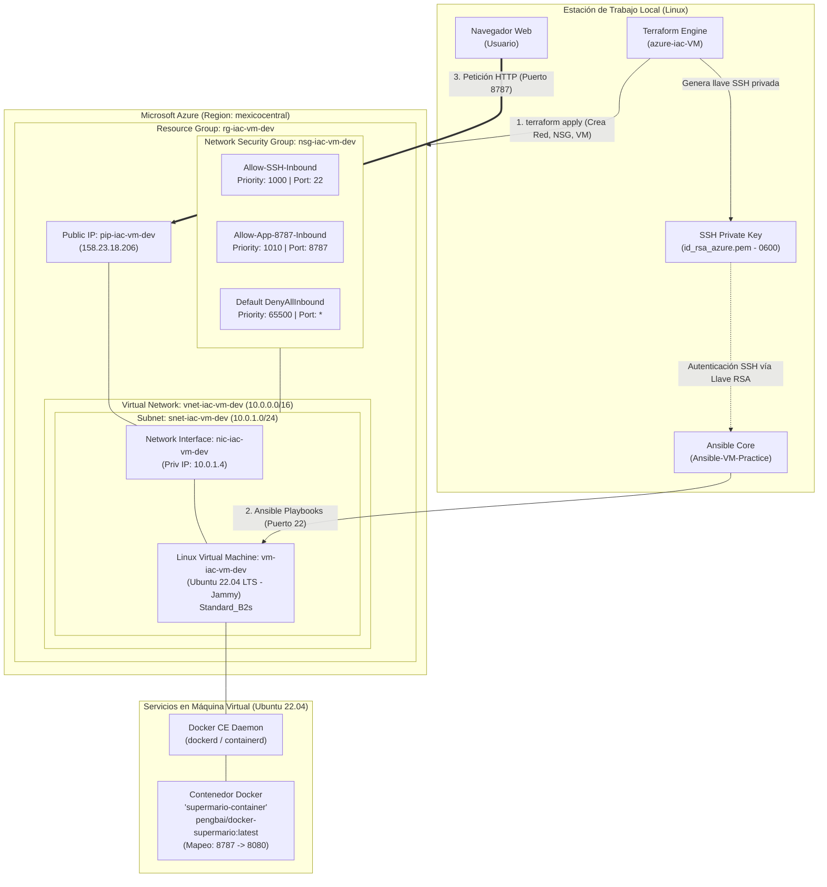
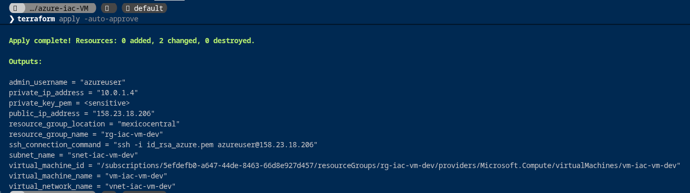
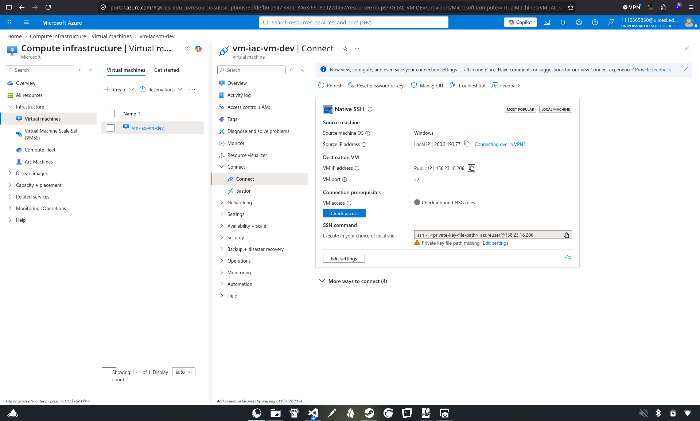
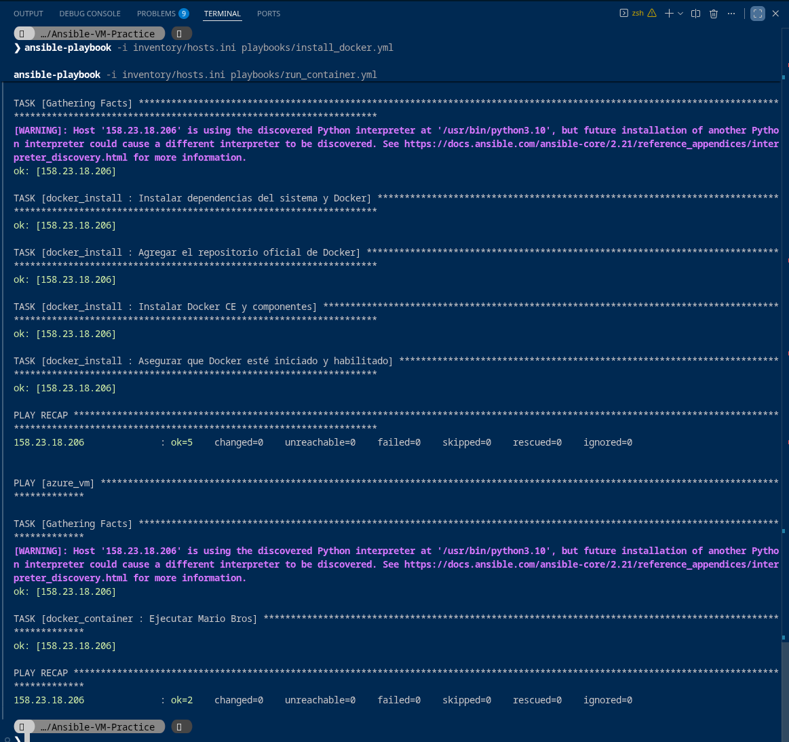
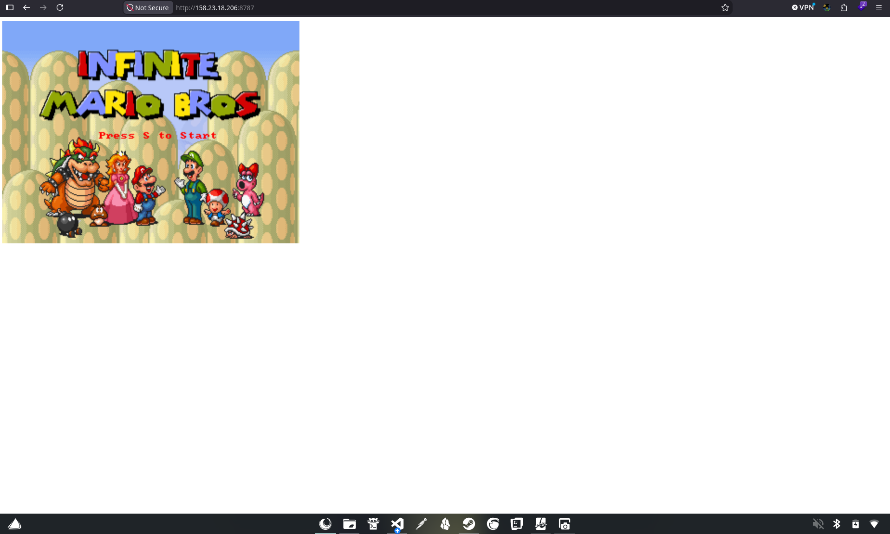

# Proyecto de Aprovisionamiento y Automatización: Azure + Terraform + Ansible + Docker

Este repositorio documenta el diseño, aprovisionamiento, resolución de incidencias y despliegue automatizado de una solución completa de infraestructura y aplicaciones en la nube de **Microsoft Azure**, utilizando el paradigma de **Infraestructura como Código (IaC)** con **Terraform**, la gestión de configuración y orquestación con **Ansible**, y la ejecución de contenedores mediante **Docker**.

---

## Tabla de Contenidos

1. [Resumen Ejecutivo y Objetivos](#1-resumen-ejecutivo-y-objetivos)
2. [Arquitectura General de la Solución](#2-arquitectura-general-de-la-solución)
3. [Componentes Tecnológicos y Stack Utilizado](#3-componentes-tecnológicos-y-stack-utilizado)
4. [Estructura del Proyecto y Repositorios](#4-estructura-del-proyecto-y-repositorios)
5. [Fase 1: Aprovisionamiento de Infraestructura con Terraform](#5-fase-1-aprovisionamiento-de-infraestructura-con-terraform)
6. [Fase 2: Diagnóstico Forense y Resolución de Incidencias](#6-fase-2-diagnóstico-forense-y-resolución-de-incidencias)
   - [Incidencia 1: Error de Autenticación SSH (`Permission denied (publickey)`)](#incidencia-1-error-de-autenticación-ssh-permission-denied-publickey)
   - [Incidencia 2: Advertencias de Depreciación y Obsolescencia en el Rol de Docker](#incidencia-2-advertencias-de-depreciación-y-obsolescencia-en-el-rol-de-docker)
   - [Incidencia 3: Dependencia Faltante del SDK de Python para Docker](#incidencia-3-dependencia-faltante-del-sdk-de-python-para-docker)
   - [Incidencia 4: Bloqueo de Acceso Web en el Firewall Perimetral (NSG)](#incidencia-4-bloqueo-de-acceso-web-en-el-firewall-perimetral-nsg)
7. [Fase 3: Configuración y Despliegue con Ansible](#7-fase-3-configuración-y-despliegue-con-ansible)
   - [Playbook 1: Instalación y Configuración de Docker (`install_docker.yml`)](#playbook-1-instalación-y-configuración-de-docker-install_dockeryml)
   - [Playbook 2: Despliegue del Contenedor de la Aplicación (`run_container.yml`)](#playbook-2-despliegue-del-contenedor-de-la-aplicación-run_containeryml)
8. [Fase 4: Verificación Funcional y Acceso desde el Navegador](#8-fase-4-verificación-funcional-y-acceso-desde-el-navegador)
9. [Evidencias Gráficas del Proyecto](#9-evidencias-gráficas-del-proyecto)
10. [Guía de Reproducción Paso a Paso](#10-guía-de-reproducción-paso-a-paso)
11. [Buenas Prácticas de Seguridad y Mantenimiento](#11-buenas-prácticas-de-seguridad-y-mantenimiento)

---

## 1. Resumen Ejecutivo y Objetivos

El objetivo principal de esta práctica consistió en diseñar una cadena de automatización continua basada en dos principios clave de la ingeniería de plataformas y DevOps:

- **Separación de Responsabilidades:**
  - **Terraform** se encarga exclusivamente del ciclo de vida de la infraestructura en la nube (_Day 0 / Day 1_): creación de redes virtuales, subredes, grupos de seguridad, interfaces de red, asignación de IP pública y aprovisionamiento de la máquina virtual (cómputo).
  - **Ansible** asume la configuración del sistema operativo y despliegue del software (_Day 1 / Day 2_): aprovisionamiento de repositorios seguros, paquetes dependientes, motor de Docker y el ciclo de vida del contenedor de la aplicación.
- **Inmutabilidad y Automatización Idempotente:** Garantizar que la ejecución repetida de los playbooks de Ansible y los planes de Terraform mantengan el estado deseado del sistema sin provocar efectos secundarios indeseados o inconsistencias.
- **Acceso Seguro a la Aplicación:** Desplegar una aplicación web interactiva en contenedor (Super Mario Bros en emulación web sobre Tomcat) expuesta controladamente a través del puerto TCP `8787`.

---

## 2. Arquitectura General de la Solución

El siguiente diagrama detalla la interacción entre el entorno de desarrollo local, los recursos aprovisionados en Microsoft Azure y los flujos de comunicación SSH y HTTP:



---

## 3. Componentes Tecnológicos y Stack Utilizado

| Tecnología           | Versión / Tipo                                      | Función en el Proyecto                                                        |
| :------------------- | :-------------------------------------------------- | :---------------------------------------------------------------------------- |
| **Microsoft Azure**  | Cloud Provider                                      | Proveedor de infraestructura en la nube (Región: `mexicocentral`).            |
| **Terraform**        | v1.x (Provider: `azurerm` ~> 3.0 / `hashicorp/tls`) | Orquestador de Infraestructura como Código (IaC).                             |
| **Ansible Core**     | v2.21+ (Python 3.10+)                               | Orquestación de configuración y aprovisionamiento de paquetes.                |
| **OpenSSH**          | 8.9p1 / 10.5                                        | Protocolo de administración remota autenticado exclusivamente con llaves RSA. |
| **Ubuntu Server**    | 22.04.5 LTS (_Jammy Jellyfish_)                     | Sistema operativo base instalado en la máquina virtual.                       |
| **Docker Engine**    | CE 26.x + Containerd                                | Motor de ejecución y ciclo de vida de contenedores Linux.                     |
| **Docker Container** | `pengbai/docker-supermario:latest`                  | Aplicación web emulada basada en Java/Tomcat sirviendo en puerto `8080`.      |

---

## 4. Estructura del Proyecto y Repositorios

El entorno de trabajo se organizó en dos proyectos complementarios:

### A. Repositorio de Automatización con Ansible (`Ansible-VM-Practice`)

```
Ansible-VM-Practice/
├── ansible.cfg                          # Parámetros por defecto de Ansible (host_key_checking, roles_path)
├── inventory/
│   └── hosts.ini                        # Inventario con IP, usuario y ruta a llave privada SSH
├── playbooks/
│   ├── install_docker.yml               # Playbook de instalación del entorno Docker
│   └── run_container.yml                # Playbook para ejecución del contenedor
├── roles/
│   ├── docker_install/                  # Rol para aprovisionar dependencias y Docker CE
│   │   └── tasks/
│   │       └── main.yml
│   └── docker_container/                # Rol para levantar el contenedor de la aplicación
│       └── tasks/
│           └── main.yml
├── Fotos/                               # Evidencias gráficas de ejecución
│   ├── Terraform_Apply.png
│   ├── VM_Azure.png
│   ├── Ansible_Configurations_Applied.png
│   └── Mario_Page.png
└── README.md                            # Informe técnico integral del proyecto
```

### B. Módulo de Infraestructura con Terraform (`azure-iac-VM`)

```
azure-iac-VM/
├── main.tf                              # Ensamblado principal de módulos
├── variables.tf                         # Declaración de variables de entrada globales
├── outputs.tf                           # Salidas de infraestructura (IPs, comandos SSH)
├── locals.tf                            # Convenciones de nombres estandarizados y etiquetas
├── terraform.tfvars                     # Valores de configuración del entorno 'dev'
├── id_rsa_azure.pem                     # Llave privada RSA generada dinámicamente por Terraform
└── modules/
    ├── resource_group/                  # Módulo para el Azure Resource Group
    ├── network/                         # Módulo para VNet, Subred y Public IP
    ├── security/                        # Módulo para Network Security Group y reglas de firewall
    │   ├── main.tf                      # Reglas de entrada (SSH y Aplicación 8787)
    │   └── variables.tf
    └── compute/                         # Módulo para NIC, Par de Llaves y Linux VM
```

---

## 5. Fase 1: Aprovisionamiento de Infraestructura con Terraform

El aprovisionamiento de la máquina virtual y sus recursos de red asociados se efectuó mediante Terraform.

### 1. Inicialización y Validación

Se ejecutó la descarga de proveedores (`azurerm`, `tls`, `local`) y la comprobación estática de sintaxis:

```bash
terraform init
terraform validate
```

### 2. Planificación y Despliegue

Se generó el plan de ejecución y se aplicaron los recursos sobre la suscripción de Azure:

```bash
terraform plan
terraform apply -auto-approve
```

Durante esta fase se aprovisionaron los siguientes recursos:

- **Resource Group:** `rg-iac-vm-dev` en la región `mexicocentral`.
- **Red Virtual y Subred:** `vnet-iac-vm-dev` (`10.0.0.0/16`) y subred `snet-iac-vm-dev` (`10.0.1.0/24`).
- **Dirección IP Pública Estática:** Asignada como `158.23.18.206`.
- **Llave Criptográfica SSH:** Par de claves RSA de 4096 bits (`tls_private_key`), guardando la llave privada localmente en `id_rsa_azure.pem` con permisos de lectura restringidos (`0600`) e inyectando la llave pública en el usuario `azureuser` de la VM.
- **Máquina Virtual:** SKU `Standard_B2s` con imagen oficial `Canonical:0001-com-ubuntu-server-jammy:22_04-lts-gen2:latest`.

---

## 6. Fase 2: Diagnóstico Forense y Resolución de Incidencias

Al momento de ejecutar los playbooks de Ansible inicialmente, se produjeron fallos críticos que impidieron la conectividad y el aprovisionamiento. A continuación se documenta el análisis de causa raíz y las soluciones aplicadas:

### Incidencia 1: Error de Autenticación SSH (`Permission denied (publickey)`)

#### Síntoma Observado:

```
TASK [Gathering Facts] *****************************************************************
[ERROR]: Task failed: Failed to connect to the host via ssh: azureuser@158.23.18.206: Permission denied (publickey).
fatal: [158.23.18.206]: UNREACHABLE! => {
    "changed": false,
    "msg": "Task failed: Failed to connect to the host via ssh: azureuser@158.23.18.206: Permission denied (publickey).",
    "unreachable": true
}
```

#### Análisis Forense:

Al inspeccionar `inventory/hosts.ini`, el host estaba configurado con:

```ini
[azure_vm]
158.23.18.206 ansible_user=azureuser ansible_ssh_pass=password
```

Se ejecutó un sondeo detallado mediante `ssh -v` hacia el host:

```bash
ssh -v -o ConnectTimeout=5 -o BatchMode=yes azureuser@158.23.18.206
```

El servidor SSH de la máquina virtual respondió con:

```
debug1: Authentications that can continue: publickey
debug1: Next authentication method: publickey
azureuser@158.23.18.206: Permission denied (publickey).
```

**Causa Raíz:**

1. Las imágenes de Azure Linux generadas por Terraform establecen `PasswordAuthentication no` en `/etc/ssh/sshd_config`. El servidor SSH rechaza tajantemente cualquier intento de autenticación por contraseña y exige una llave pública registrada.
2. Ansible requiere la utilidad del sistema `sshpass` para autenticación interactiva por contraseña cuando se usa `ansible_ssh_pass`, la cual tampoco estaba disponible.

#### Solución Implementada:

Se actualizó [inventory/hosts.ini](file:///home/noodle/Documents/Plataformas%20II/Ansible%20Exercise/Ansible-VM-Practice/inventory/hosts.ini) enlazando la llave privada generada por Terraform durante el despliegue de la VM:

```ini
[azure_vm]
158.23.18.206 ansible_user=azureuser ansible_ssh_private_key_file="/home/noodle/Documents/Plataformas II/Terraform VM/azure-iac-VM/id_rsa_azure.pem"
```

Se validó inmediatamente la conectividad con el módulo ping de Ansible:

```bash
ansible -i inventory/hosts.ini azure_vm -m ping
# 158.23.18.206 | SUCCESS => { "ping": "pong" }
```

---

### Incidencia 2: Advertencias de Depreciación y Obsolescencia en el Rol de Docker

#### Síntoma Observado:

```
[DEPRECATION WARNING]: ansible.builtin.apt_key has been deprecated. Use deb822_repository instead. This feature will be removed from ansible-core version 2.25.
[DEPRECATION WARNING]: ansible.builtin.apt_repository has been deprecated. Use deb822_repository instead. This feature will be removed from ansible-core version 2.25.
```

#### Análisis Forense:

El archivo de tareas original (`roles/docker_install/tasks/main.yml`) contenía código heredado:

```yaml
- name: Agregar la clave GPG oficial de Docker
  ansible.builtin.apt_key:
    url: https://download.docker.com/linux/ubuntu/gpg
    state: present

- name: Agregar el repositorio de Docker
  ansible.builtin.apt_repository:
    repo: deb [arch=amd64] https://download.docker.com/linux/ubuntu bionic stable
    state: present
```

**Causas:**

1. Los módulos `apt_key` y `apt_repository` están en proceso de remoción en Ansible Core debido a los riesgos de seguridad asociados con el almacén global `trusted.gpg` de Debian/Ubuntu.
2. El repositorio forzaba el nombre de código `bionic` (Ubuntu 18.04 LTS), mientras que la máquina virtual opera con **Ubuntu 22.04 LTS (`jammy`)**. Instalar paquetes de Docker diseñados para `bionic` sobre `jammy` causa graves discrepancias de dependencias en `libc6` y `systemd`.

#### Solución Implementada:

Se migró al módulo moderno de formato deb822 de APT: `ansible.builtin.deb822_repository`, utilizando de manera dinámica el fact del sistema `{{ ansible_facts['distribution_release'] }}`.

---

### Incidencia 3: Dependencia Faltante del SDK de Python para Docker

#### Síntoma Potencial:

Al ejecutar el módulo `community.docker.docker_container` en el playbook `run_container.yml`, Ansible se conecta a la VM y delega la gestión de contenedores a la librería de Python `docker` (Python Docker SDK). Sin esta librería instalada en el sistema de destino, la tarea arroja un fallo fatal:
`Failed to import the required Python library (Docker SDK for Python: docker)`.

#### Solución Implementada:

Se modificó la primera tarea de instalación de dependencias en [roles/docker_install/tasks/main.yml](file:///home/noodle/Documents/Plataformas%20II/Ansible%20Exercise/Ansible-VM-Practice/roles/docker_install/tasks/main.yml), incorporando explícitamente:

- `python3-debian`: Requerido en la máquina destino por el módulo `deb822_repository`.
- `python3-docker`: SDK nativo para que Ansible manipule el daemon de Docker.
- `gnupg`: Para procesar llaves GPG de APT.

---

### Incidencia 4: Bloqueo de Acceso Web en el Firewall Perimetral (NSG)

#### Síntoma Observado:

Tras completar la instalación de Docker y poner en marcha el contenedor mapeado en el puerto `8787`, las peticiones desde el navegador a `http://158.23.18.206:8787` no respondían (tiempo de espera agotado). Sin embargo, dentro de la máquina virtual el servicio respondía correctamente:

```bash
curl -I http://localhost:8787
# HTTP/1.1 200 OK
```

#### Análisis Forense:

Se inspeccionaron las reglas activas del Network Security Group `nsg-iac-vm-dev` en Azure:

```bash
az network nsg rule list -g rg-iac-vm-dev --nsg-name nsg-iac-vm-dev -o table
```

La salida confirmó que únicamente existía la regla `Allow-SSH-Inbound` en el puerto 22. Todo el tráfico entrante restante estaba siendo descartado por la regla predeterminada de Azure:
`DenyAllInbound (Priority 65500)`.

#### Solución Implementada en Terraform:

Para mantener el principio de Infraestructura como Código, la regla no se creó manualmente ni de manera efímera, sino que se integró en la base de código de Terraform:

1. En [modules/security/variables.tf](file:///home/noodle/Documents/Plataformas%20II/Terraform%20VM/azure-iac-VM/modules/security/variables.tf) y [variables.tf](file:///home/noodle/Documents/Plataformas%20II/Terraform%20VM/azure-iac-VM/variables.tf):
   ```hcl
   variable "allowed_app_port" {
     description = "The destination port allowed for application inbound traffic (e.g., 8787)."
     type        = string
     default     = "8787"
   }
   ```
2. En [modules/security/main.tf](file:///home/noodle/Documents/Plataformas%20II/Terraform%20VM/azure-iac-VM/modules/security/main.tf):
   ```hcl
     security_rule {
       name                       = "Allow-App-8787-Inbound"
       priority                   = 1010
       direction                  = "Inbound"
       access                     = "Allow"
       protocol                   = "Tcp"
       source_port_range          = "*"
       destination_port_range     = var.allowed_app_port
       source_address_prefix      = "*"
       destination_address_prefix = "*"
       description                = "Allow application inbound traffic on port ${var.allowed_app_port}"
     }
   ```
3. Se ejecutó `terraform apply`, modificando el NSG en caliente sin destruir ni reiniciar la máquina virtual.

---

## 7. Fase 3: Configuración y Despliegue con Ansible

### Playbook 1: Instalación y Configuración de Docker (`install_docker.yml`)

Este playbook aplica el rol refactorizado `docker_install`. Su archivo de tareas [roles/docker_install/tasks/main.yml](file:///home/noodle/Documents/Plataformas%20II/Ansible%20Exercise/Ansible-VM-Practice/roles/docker_install/tasks/main.yml) quedó estructurado de la siguiente forma:

```yaml
- name: Instalar dependencias del sistema y Docker
  ansible.builtin.apt:
    name:
      - apt-transport-https
      - ca-certificates
      - curl
      - gnupg
      - software-properties-common
      - python3-debian
      - python3-docker
    state: present
    update_cache: yes

- name: Agregar el repositorio oficial de Docker
  ansible.builtin.deb822_repository:
    name: docker
    types: deb
    uris: https://download.docker.com/linux/ubuntu
    suites: "{{ ansible_facts['distribution_release'] }}"
    components:
      - stable
    architectures:
      - amd64
    signed_by: https://download.docker.com/linux/ubuntu/gpg
    state: present

- name: Instalar Docker CE y componentes
  ansible.builtin.apt:
    name:
      - docker-ce
      - docker-ce-cli
      - containerd.io
      - docker-buildx-plugin
      - docker-compose-plugin
    state: present
    update_cache: yes

- name: Asegurar que Docker esté iniciado y habilitado
  ansible.builtin.service:
    name: docker
    state: started
    enabled: yes
```

**Ejecución del Playbook:**

```bash
ansible-playbook -i inventory/hosts.ini playbooks/install_docker.yml
```

**Resultado:**

```
PLAY RECAP *********************************************************************
158.23.18.206              : ok=5    changed=3    unreachable=0    failed=0    skipped=0    rescued=0    ignored=0
```

---

### Playbook 2: Despliegue del Contenedor de la Aplicación (`run_container.yml`)

El segundo playbook aplica el rol `docker_container`. En [roles/docker_container/tasks/main.yml](file:///home/noodle/Documents/Plataformas%20II/Ansible%20Exercise/Ansible-VM-Practice/roles/docker_container/tasks/main.yml):

```yaml
- name: Ejecutar Mario Bros
  community.docker.docker_container:
    name: supermario-container
    image: "pengbai/docker-supermario:latest"
    state: started
    ports:
      - "8787:8080"
```

**Ejecución del Playbook:**

```bash
ansible-playbook -i inventory/hosts.ini playbooks/run_container.yml
```

**Resultado:**

```
PLAY RECAP *********************************************************************
158.23.18.206              : ok=2    changed=1    unreachable=0    failed=0    skipped=0    rescued=0    ignored=0
```

El estado del contenedor en la VM se verificó remotamente con `docker ps`:

```
CONTAINER ID   IMAGE                              COMMAND             STATUS          PORTS                    NAMES
ec76489664da   pengbai/docker-supermario:latest   "catalina.sh run"   Up 15 seconds   0.0.0.0:8787->8080/tcp   supermario-container
```

---

## 8. Fase 4: Verificación Funcional y Acceso desde el Navegador

Una vez que el contenedor estuvo arriba y la regla de seguridad del NSG fue aplicada en Azure, se validó la respuesta del servicio web en el puerto `8787`:

```bash
curl -I http://158.23.18.206:8787
```

**Respuesta HTTP:**

```http
HTTP/1.1 200 OK
Accept-Ranges: bytes
ETag: W/"2781-1568822980000"
Last-Modified: Wed, 18 Sep 2019 16:09:40 GMT
Content-Type: text/html
Content-Length: 2781
Date: Mon, 21 Sep 2026 23:59:08 GMT
```

La aplicación quedó disponible de manera pública y directa a través del navegador ingresando a:
👉 **`http://158.23.18.206:8787`**

---

## 9. Evidencias Gráficas del Proyecto

A continuación se presentan las capturas de pantalla de los momentos clave del aprovisionamiento, despliegue y verificación funcional:

### 1. Aprovisionamiento y Actualización de Infraestructura (Terraform Apply)

Muestra la ejecución exitosa de Terraform creando y actualizando los recursos de Azure, incluyendo la máquina virtual, la interfaz de red y la regla de entrada del grupo de seguridad:



---

### 2. Recursos Desplegados en el Portal de Microsoft Azure

Vista del panel de control de la máquina virtual `vm-iac-vm-dev` dentro del grupo de recursos `rg-iac-vm-dev`, confirmando el estado en ejecución, la dirección IP pública asignada (`158.23.18.206`) y la configuración de red perimetral:



---

### 3. Ejecución Automatizada de los Playbooks de Ansible

Captura de la consola de terminal demostrando la orquestación idempotente de Ansible: recopilación de facts, instalación de dependencias, configuración de deb822, despliegue de Docker CE y ejecución del contenedor de Super Mario con `failed=0`:



---

### 4. Aplicación Web Funcionando en el Navegador

Visualización de la interfaz gráfica interactiva de Super Mario Bros cargada desde el navegador web apuntando a la IP pública y puerto de la máquina virtual en Azure (`http://158.23.18.206:8787`):



---

## 10. Guía de Reproducción Paso a Paso

Para desplegar este entorno de pruebas desde cero en una estación de trabajo limpia, sigue los pasos a continuación:

### Requisitos Previos

- Azure CLI instalado y autenticado (`az login`).
- Terraform v1.5+ instalado.
- Ansible Core v2.15+ instalado.
- Colección de Ansible Docker:
  ```bash
  ansible-galaxy collection install community.docker
  ```

### Paso 1: Desplegar la Infraestructura con Terraform

```bash
cd "Terraform VM/azure-iac-VM"
terraform init
terraform apply -auto-approve
```

_Toma nota de la IP pública emitida en las salidas (`outputs.tf`)._

### Paso 2: Configurar el Inventario de Ansible

Edita el archivo `Ansible Exercise/Ansible-VM-Practice/inventory/hosts.ini`:

```ini
[azure_vm]
<IP_PUBLICA_AZURE> ansible_user=azureuser ansible_ssh_private_key_file="/ruta/absoluta/a/id_rsa_azure.pem"
```

### Paso 3: Probar la Conectividad con Ansible

```bash
cd "Ansible Exercise/Ansible-VM-Practice"
ansible -i inventory/hosts.ini azure_vm -m ping
```

### Paso 4: Instalar Docker en la Máquina Virtual

```bash
ansible-playbook -i inventory/hosts.ini playbooks/install_docker.yml
```

### Paso 5: Levantar el Contenedor

```bash
ansible-playbook -i inventory/hosts.ini playbooks/run_container.yml
```

### Paso 6: Acceder a la Aplicación

Abre tu navegador e ingresa a:

```
http://<IP_PUBLICA_AZURE>:8787
```

### Paso 7: Destrucción de Recursos (Ahorro de Costos)

Una vez culminada la práctica, libera todos los recursos de la nube para evitar facturación no deseada:

```bash
cd "Terraform VM/azure-iac-VM"
terraform destroy -auto-approve
```

---

## 11. Buenas Prácticas de Seguridad y Mantenimiento

1. **Gestión de Llaves Privadas:**
   - Nunca agregues al control de versiones (`.gitignore`) las llaves SSH privadas (`*.pem`, `*.id_rsa`).
   - Mantén permisos estrictos en los archivos de llaves (`chmod 600 id_rsa_azure.pem`).
2. **Seguridad Perimetral (Least Privilege):**
   - En ambientes de producción, restringe `allowed_ssh_source_address_prefix` en `terraform.tfvars` a tu dirección IP pública o rango VPN corporativo en lugar de `*`.
3. **Idempotencia de Ansible:**
   - Utiliza nombres de módulo calificados por colección (FQCN) como `ansible.builtin.apt` y `community.docker.docker_container`.
   - Evita el uso de comandos planos (`shell` / `command`) cuando existan módulos nativos idempotentes.
4. **Repositorios Modernos en Debian/Ubuntu:**
   - Adopta el formato deb822 (`deb822_repository`) con llaves aisladas en `/etc/apt/keyrings/` para cumplir con las directrices de seguridad de las distribuciones Linux contemporáneas.
